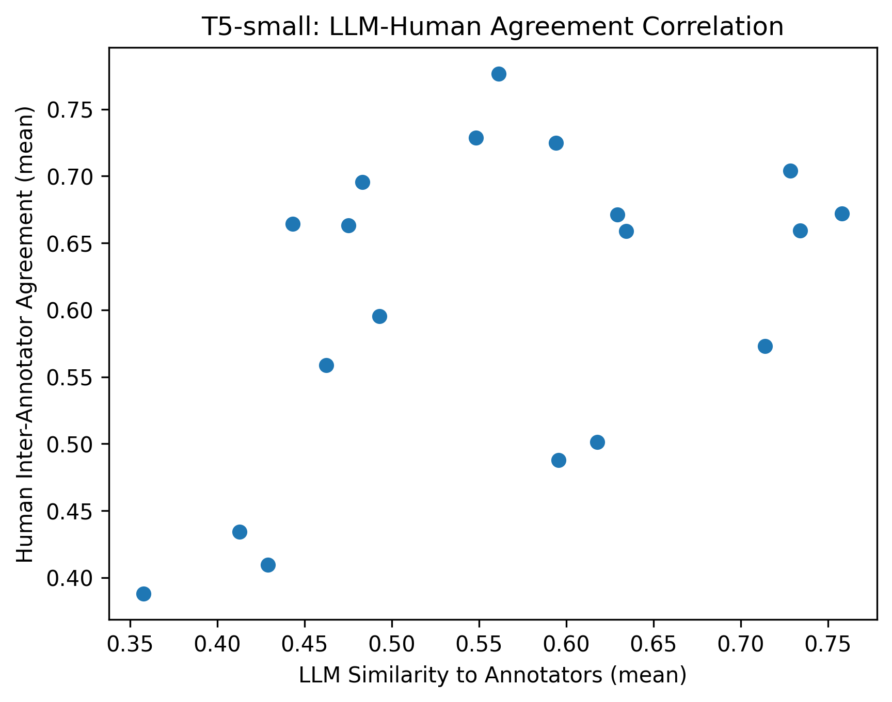
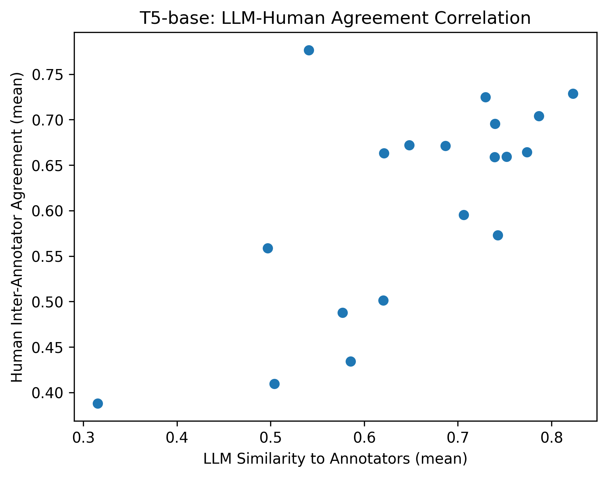
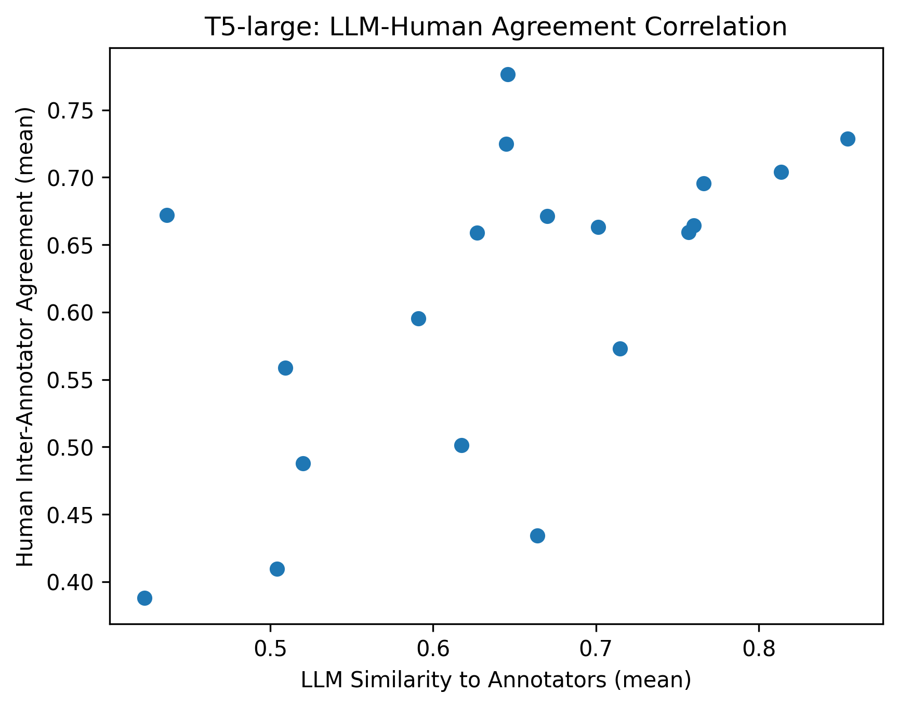

# Training Intent Generation Models 

 blablabla <3
 mention the 3 T5 models, the 2 Qwen models

# Analysis of Intent Generation Models

Once the T5 and Qwen models were trained on our ~1800 annotations on the WildGuard dataset, we performed inference on 20 prompts from the `AmazonScience/FalseReject` dataset from HuggingFace, found here : https://huggingface.co/datasets/AmazonScience/FalseReject/viewer/default/train?views%5B%5D=train 

We used prompts from this dataset to analyze the model's behavior, and compare it to that of our own annotations on the same prompts.

The three of us first annotated the 20 prompts from the `AmazonScience/FalseReject` dataset ourselves, and measured our inter-annotator agreement using mean cosine similarity across the 20 prompts. This is shown in the table below. Our overall mean inter-annotator agreement is 0.611. 

|      | Ann1  | Ann2  | Ann3  |
|------|-------|-------|-------|
| Ann1 | 1.000 | 0.620 | 0.586 |
| Ann2 | 0.620 | 1.000 | 0.626 |
| Ann3 | 0.586 | 0.626 | 1.000 |

Then, we used the prompts generated by the trained T5-small, T5-base and T5-large and analyzed their mean cosine similarity with our prompts. The table below shoes this comparison per annotator, and the last column showing the mean cosine similarity for each T5 model across all annotators. 

| Model     | T5 vs Ann1 | T5 vs Ann2 | T5 vs Ann3 | T5 vs All Ann |
|-----------|------------|------------|------------|---------------|
| T5-small  | 0.597      | 0.606      | 0.482      | 0.562         |
| T5-base   | 0.676      | 0.683      | 0.596      | 0.652         |
| T5-large  | 0.679      | 0.676      | 0.575      | 0.643         |

It can be seen that the T5-base model has the highest mean cosine similarity across the 3 annotators, while the T5-small has the lowest similarity. 

As a further analysis, we explored if there is a correlation with LLM agreement to the annotators for prompts where annotators agreed more with each other. In other words, if there is a correlation between inter-annotator agreement, and LLM aggrement with annotators. We computed the correlation between LLM-human agreement and human-human agreement per prompt shown in the table below as well as some scatterplots.

  
  
  

| Model     | Correlation (LLM vs Human Agreement) | p-value |
|-----------|--------------------------------------|--------|
| T5-small  | 0.468                                | 0.0433 |
| T5-base   | 0.679                                | 0.0014 |
| T5-large  | 0.590                                | 0.0078 |

It can be seen that T5-base shows a moderately positive correlation in agreement with human annotators, while T5-small does not show a clear correlation. 